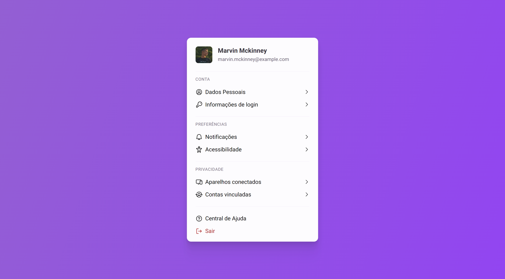

<h1 align="center"> Configurações de perfil - BoraCodar#22 </h1>

[Clique aqui para acessar]()

## 🚀 Tecnologias

Esse projeto foi desenvolvido com as seguintes tecnologias:

- React.js
- React router dom (biblioteca)
- Phosphor Icons (biblioteca)
- Git and GitHub

## 💻 Projeto

Este projeto simula uma interface de tela de Configurações de perfil de usuário. Utilizando a biblioteca react-router-dom, consegui criar várias telas em rotas diferentes para proporcionar uma experiência autêntica.  

Projeto construído a partir do layout proposto no desafio [#BoraCodar21](https://boracodar.dev/) realizado pela [Rocketseat](https://rocketseat.com.br).
Após o desenvolvimento do projeto inicial, adicionei novas features, tais quais:

- Layout responsivo (Adaptado para telas menores);
- Botões funcionais;
- Efeitos hover;
- Telas dinâmicas;
- Entre outras pequenas modificações.

## 🔖 Layout

Você pode visualizar o layout do projeto proposto através [DESSE LINK](https://www.figma.com/community/file/1243194167725942248). É necessário ter conta no [Figma](https://figma.com) para acessá-lo.